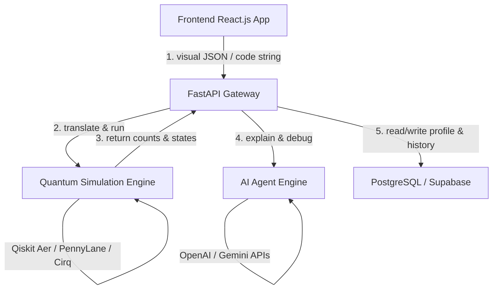

# Implementation Plan - AI-Based Interactive Quantum Algorithm Learning Platform (IQ-ALP)

This document contains the complete architectural blueprint, design specifications, and core setups for **IQ-ALP**. The workspace has been cleaned and reset, and no code files have been written to your workspace.

---

## 1. PROJECT SPECIFICATION & IDEA

**IQ-ALP** is a web-based educational platform that accelerates quantum computing concepts by bridging visual design, interactive coding, math visualization, and AI assistance.



---

## 2. DIRECTORY & FILE STRUCTURE

The proposed layout splits the application cleanly into a client-server architecture:

```text
QuantumCraft/
├── api/
│   └── contracts.md                      # REST API Endpoints Specs & Models
├── backend/
│   ├── ai_prompts.md                     # System Prompts (Debugging, Explainers)
│   ├── main.py                           # FastAPI application gateway
│   ├── simulator.py                      # Qiskit parsing & Aer simulation engine
│   └── requirements.txt                  # Python package specifications
├── database/
│   └── schema.sql                        # PostgreSQL / Supabase Schema (RLS active)
├── frontend/
│   ├── components/
│   │   └── QuantumCanvas.jsx             # React Flow Circuit Builder component
│   └── package.json                      # NPM dependencies (Three.js, React Flow)
```

---

## 3. RELATIONAL DATABASE SCHEMA (`database/schema.sql`)

```sql
-- Enable UUID extension
CREATE EXTENSION IF NOT EXISTS "uuid-ossp";

-- 1. USERS TABLE
CREATE TABLE IF NOT EXISTS users (
    id UUID PRIMARY KEY DEFAULT uuid_generate_v4(),
    email VARCHAR(255) UNIQUE NOT NULL,
    full_name VARCHAR(255),
    role VARCHAR(50) DEFAULT 'student' CHECK (role IN ('student', 'instructor', 'admin')),
    created_at TIMESTAMP WITH TIME ZONE DEFAULT CURRENT_TIMESTAMP,
    updated_at TIMESTAMP WITH TIME ZONE DEFAULT CURRENT_TIMESTAMP
);

-- 2. COURSES TABLE
CREATE TABLE IF NOT EXISTS courses (
    id UUID PRIMARY KEY DEFAULT uuid_generate_v4(),
    title VARCHAR(255) NOT NULL,
    description TEXT,
    difficulty VARCHAR(50) DEFAULT 'beginner' CHECK (difficulty IN ('beginner', 'intermediate', 'advanced')),
    created_at TIMESTAMP WITH TIME ZONE DEFAULT CURRENT_TIMESTAMP
);

-- 3. LESSONS TABLE
CREATE TABLE IF NOT EXISTS lessons (
    id UUID PRIMARY KEY DEFAULT uuid_generate_v4(),
    course_id UUID REFERENCES courses(id) ON DELETE CASCADE,
    title VARCHAR(255) NOT NULL,
    content TEXT, -- Markdown content
    position INTEGER NOT NULL, -- Sorting index
    created_at TIMESTAMP WITH TIME ZONE DEFAULT CURRENT_TIMESTAMP
);

-- 4. SAVED CIRCUITS TABLE
CREATE TABLE IF NOT EXISTS saved_circuits (
    id UUID PRIMARY KEY DEFAULT uuid_generate_v4(),
    user_id UUID REFERENCES users(id) ON DELETE CASCADE,
    name VARCHAR(255) NOT NULL,
    description TEXT,
    canvas_json JSONB, -- JSON representation of React Flow AST
    code_snippet TEXT, -- Qiskit / Cirq code snippet
    framework VARCHAR(50) DEFAULT 'qiskit' CHECK (framework IN ('qiskit', 'pennylane', 'cirq')),
    created_at TIMESTAMP WITH TIME ZONE DEFAULT CURRENT_TIMESTAMP,
    updated_at TIMESTAMP WITH TIME ZONE DEFAULT CURRENT_TIMESTAMP
);

-- 5. USER PROGRESS TABLE
CREATE TABLE IF NOT EXISTS user_progress (
    id UUID PRIMARY KEY DEFAULT uuid_generate_v4(),
    user_id UUID REFERENCES users(id) ON DELETE CASCADE,
    lesson_id UUID REFERENCES lessons(id) ON DELETE CASCADE,
    completed BOOLEAN DEFAULT TRUE,
    completed_at TIMESTAMP WITH TIME ZONE DEFAULT CURRENT_TIMESTAMP,
    UNIQUE(user_id, lesson_id)
);

-- 6. CHALLENGES TABLE
CREATE TABLE IF NOT EXISTS challenges (
    id UUID PRIMARY KEY DEFAULT uuid_generate_v4(),
    title VARCHAR(255) NOT NULL,
    description TEXT,
    target_state_vector TEXT,
    target_counts JSONB,
    difficulty VARCHAR(50) DEFAULT 'beginner' CHECK (difficulty IN ('beginner', 'intermediate', 'advanced')),
    points INTEGER DEFAULT 10,
    created_at TIMESTAMP WITH TIME ZONE DEFAULT CURRENT_TIMESTAMP
);

-- 7. CHALLENGE SUBMISSIONS TABLE
CREATE TABLE IF NOT EXISTS challenge_submissions (
    id UUID PRIMARY KEY DEFAULT uuid_generate_v4(),
    user_id UUID REFERENCES users(id) ON DELETE CASCADE,
    challenge_id UUID REFERENCES challenges(id) ON DELETE CASCADE,
    submitted_circuit_json JSONB,
    submitted_code TEXT,
    status VARCHAR(50) NOT NULL CHECK (status IN ('passed', 'failed', 'pending')),
    feedback TEXT,
    submitted_at TIMESTAMP WITH TIME ZONE DEFAULT CURRENT_TIMESTAMP
);
```

---

## 4. API CONTRACTS (`api/contracts.md`)

### `POST /api/v1/simulate`
*   **Request Payload:**
    ```json
    {
      "backend": "qiskit",
      "qubit_count": 2,
      "circuit_ast": [
        { "gate": "h", "targets": [0] },
        { "gate": "cx", "targets": [0, 1] },
        { "gate": "measure", "targets": [0], "classical_reg": 0 }
      ],
      "shots": 1024
    }
    ```
*   **Response Payload (200 OK):**
    ```json
    {
      "status": "success",
      "execution_time_ms": 12.45,
      "backend_used": "qiskit_qasm_simulator",
      "counts": { "00": 521, "11": 503 },
      "state_vector": [[0.707106, 0.0], [0.0, 0.0], [0.0, 0.0], [0.707106, 0.0]],
      "bloch_vectors": [
        { "qubit": 0, "x": 0.0, "y": 0.0, "z": 0.0 },
        { "qubit": 1, "x": 0.0, "y": 0.0, "z": 0.0 }
      ]
    }
    ```

### `POST /api/v1/ai/explain`
*   **Request Payload:**
    ```json
    {
      "circuit_ast": [{ "gate": "h", "targets": [0] }],
      "current_code": "qc.h(0)",
      "target_concept": "superposition"
    }
    ```
*   **Response Payload (200 OK):**
    ```json
    {
      "explanation": "Your circuit creates a state of superposition...",
      "visual_highlights": { "qubits": [0], "key_gates": ["h"] }
    }
    ```

---

## 5. STARTER CODE SKELETONS

### A. Backend FastAPI Route with Qiskit Simulation (`backend/simulator.py` / `main.py`)
```python
from fastapi import FastAPI
from pydantic import BaseModel
from typing import List, Dict, Any, Optional
import numpy as np
from qiskit import QuantumCircuit
from qiskit.quantum_info import Statevector, partial_trace

app = FastAPI()

class GateInstruction(BaseModel):
    gate: str
    targets: List[int]
    classical_reg: Optional[int] = None
    params: Optional[List[float]] = None

class SimulationRequest(BaseModel):
    backend: str = "qiskit"
    qubit_count: int
    circuit_ast: List[GateInstruction]
    shots: int = 1024

def calculate_bloch_coordinates(state_vector: Statevector, num_qubits: int):
    bloch_vectors = []
    for q in range(num_qubits):
        q_indices = list(range(num_qubits))
        q_indices.remove(q)
        rho = state_vector.to_operator().data if num_qubits == 1 else partial_trace(state_vector, q_indices).data
        x = float(2 * np.real(rho[0, 1]))
        y = float(2 * np.imag(rho[1, 0]))
        z = float(np.real(rho[0, 0] - rho[1, 1]))
        bloch_vectors.append({"qubit": q, "x": round(x, 4), "y": round(y, 4), "z": round(z, 4)})
    return bloch_vectors

@app.post("/api/v1/simulate")
def simulate(req: SimulationRequest):
    qc = QuantumCircuit(req.qubit_count)
    for gate_inst in req.circuit_ast:
        gname = gate_inst.gate.lower()
        t = gate_inst.targets
        if gname == "h":
            qc.h(t[0])
        elif gname == "cx":
            qc.cx(t[0], t[1])
        # Add additional gates...
    sv = Statevector.from_instruction(qc)
    bloch = calculate_bloch_coordinates(sv, req.qubit_count)
    return {
        "status": "success",
        "state_vector": [[float(np.real(val)), float(np.imag(val))] for val in sv.data],
        "bloch_vectors": bloch
    }
```

### B. Frontend Drag-and-Drop Canvas Component Blueprint (`frontend/components/QuantumCanvas.jsx`)
```jsx
import React, { useState, useCallback } from 'react';
import { ReactFlow, useNodesState, useEdgesState, addEdge } from '@xyflow/react';
import '@xyflow/react/dist/style.css';

export default function QuantumCanvas({ onCircuitChange }) {
  const [nodes, setNodes, onNodesChange] = useNodesState([
    { id: 'q-0', type: 'output', data: { label: 'q[0]' }, position: { x: 50, y: 100 } },
    { id: 'q-1', type: 'output', data: { label: 'q[1]' }, position: { x: 50, y: 200 } }
  ]);
  const [edges, setEdges, onEdgesChange] = useEdgesState([]);

  const onConnect = useCallback((params) => setEdges((eds) => addEdge(params, eds)), []);

  const addGate = (gateType, qubitIndex) => {
    const id = `gate-${gateType}-${Date.now()}`;
    const newNode = {
      id,
      type: 'default',
      position: { x: 200, y: 100 + (qubitIndex * 100) },
      data: { label: gateType.toUpperCase(), gate: gateType, qubit: qubitIndex }
    };
    setNodes((nds) => nds.concat(newNode));
  };

  return (
    <div style={{ width: '100%', height: '500px', background: '#0f172a' }}>
      <button onClick={() => addGate('h', 0)}>Add H Gate to Q0</button>
      <button onClick={() => addGate('cx', 1)}>Add CNOT Gate to Q1</button>
      <ReactFlow nodes={nodes} edges={edges} onNodesChange={onNodesChange} onEdgesChange={onEdgesChange} onConnect={onConnect} />
    </div>
  );
}
```

---

## 6. TEAM MEMBER WORKFLOWS & TOOLKITS

### SECTION A: DHAIRYA
**Role:** Backend Integration, Database Architecture, and AI Orchestration Manager

#### Responsibilities
- Set up Supabase PostgreSQL db schema and create row-level security policies.
- Build the FastAPI server configurations, authentication gates, and route management.
- Develop structured prompt templates and AI endpoints integrating with OpenAI/Gemini SDKs.

#### Tools & Libraries
- **FastAPI / Uvicorn:** Async server engine.
- **Supabase SDK (`supabase-py`):** Supabase database & auth integration.
- **SQLModel / SQLAlchemy:** Safe ORM mappings.
- **Google GenerativeAI SDK / OpenAI SDK:** Structured LLM processing.
- **python-jose:** JWT token validation.

---

### SECTION B: HET
**Role:** Quantum Simulator & Algorithmic Concepts Engine Developer

#### Responsibilities
- Build AST-to-Qiskit parser converting drag-and-drop representation into quantum objects.
- Setup simulation backends utilizing Qiskit Aer, PennyLane, and Cirq.
- Calculate state vectors, histograms, and single-qubit Bloch vector matrices.

#### Tools & Libraries
- **Qiskit / Qiskit-Aer:** Core quantum simulation.
- **PennyLane / Cirq:** Multi-framework simulator backends.
- **NumPy / SciPy:** Matrix math operations on state vectors and density matrices.

---

### SECTION C: ANSH
**Role:** Interactive Frontend & User Experience (UX) Developer

#### Responsibilities
- Implement visual workspace layouts, landing page design, and student/instructor panels.
- Build the React Flow Drag-and-Drop canvas synced with a shared Zustand AST state.
- Render 3D Bloch sphere vector rotations using React Three Fiber.

#### Tools & Libraries
- **Next.js / Tailwind CSS:** Core UI framework.
- **@xyflow/react (React Flow):** Visual Node-based canvas editor.
- **React Three Fiber / Three.js:** 3D vector sphere representation.
- **Plotly.js:** High performance probability charts.
- **Zustand:** Global state store.
